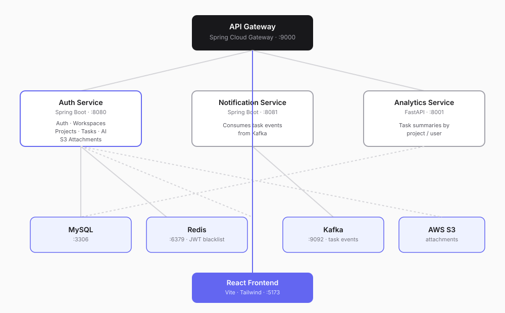

# TaskFlow

**A production-style project management platform built as a distributed microservices system** — auth, real-time task boards, AI-assisted planning, and file attachments, all containerized and CI/CD-driven.


Built solo end-to-end: backend services, event-driven notifications, React frontend, test suite, Docker orchestration, and CI/CD pipeline.

---

## What it does

TaskFlow is a Jira/Linear-style tool where teams organize work into **Workspaces → Projects → Tasks**, track progress on a drag-and-drop Kanban board, get AI-generated task breakdowns from a plain-English project description, attach files to tasks (stored in S3), and receive event-driven notifications when task state changes.

## Architecture

Five independently deployable services, communicating over REST and Kafka events:



## Tech stack

| Layer | Technology |
|---|---|
| Backend | Java 21, Spring Boot 3.5, Spring Security (JWT), Spring Data JPA |
| AI | Spring AI + Groq (Llama 3.3 70B) for task suggestion generation |
| Analytics | Python, FastAPI, SQLAlchemy |
| Messaging | Apache Kafka |
| Caching | Redis |
| Database | MySQL 8 |
| Storage | AWS S3 (task attachments) |
| Frontend | React 19, Vite, Tailwind CSS 4, react-router, @hello-pangea/dnd |
| Testing | JUnit 5, Mockito, Testcontainers (real MySQL in tests), JaCoCo |
| CI/CD | GitHub Actions (test → build → push to Docker Hub) |
| Infra | Docker, Docker Compose, multi-stage builds |

## Key engineering decisions

- **JWT auth with Redis-backed token blacklist** — logout actually invalidates tokens server-side, not just client-side deletion.
- **Testcontainers over H2** for integration tests — tests run against real MySQL, not an in-memory approximation, catching dialect issues H2 would hide.
- **Kafka for task-status events** — Notification Service is fully decoupled from Auth Service; it consumes events asynchronously rather than being called synchronously.
- **API Gateway with env-driven routing** — service hostnames are injected via environment variables, so the same gateway config works unchanged across local dev and containerized environments.
- **S3 uploads streamed, not buffered** — files are streamed directly to S3 via `RequestBody.fromInputStream`, avoiding loading entire files into memory.

## Features

- Email/password auth with JWT, role-based access, Redis token blacklist on logout
- Workspaces → Projects → Tasks hierarchy with full CRUD
- Drag-and-drop Kanban board (To do / In progress / Done)
- AI-generated task suggestions from a natural-language project description
- File attachments per task, stored in S3, metadata in MySQL
- Async notifications on task events via Kafka
- Analytics endpoints (task summaries by project/user) via a separate FastAPI service

## Testing

8 automated tests covering:
- Unit tests (`@WebMvcTest`) for controller request/response contracts
- Repository tests (`@DataJpaTest` + Testcontainers) against real MySQL
- Full integration test (`@SpringBootTest`) exercising the actual register → login flow end-to-end

```bash
cd auth-service && ./mvnw test
```

## Running locally

Requires Docker, Docker Compose, and Node.js.

```bash
git clone https://github.com/Anshd14/TaskFlow.git
cd TaskFlow
```

Create a `.env` file in the repo root:JWT_SECRET=404E635266556A586E3272357538782F413F4428472B4B6250645367566B5970
GROQ_API_KEY=your_groq_api_key
AWS_ACCESS_KEY_ID=your_aws_access_key
AWS_SECRET_ACCESS_KEY=your_aws_secret_key
AWS_REGION=ap-south-1
AWS_S3_BUCKET=your_s3_bucket_name                                                  
Start the backend:
```bash
docker-compose up -d --build
```

This starts all 7 containers (MySQL, Redis, Kafka, and all 4 backend services) with healthchecks gating startup order. The API Gateway is available at `http://localhost:9000`.

Start the frontend:
```bash
cd frontend
npm install
npm run dev
```

The app is available at `http://localhost:5173`.

## CI/CD

Every push to `main` runs the full test suite against a real MySQL service container, then on success builds and pushes versioned Docker images for all 4 backend services to Docker Hub.

---

Built by [Ansh Dixit](https://github.com/Anshd14)
